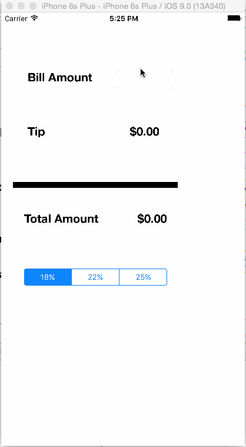

# NewTipCalc
New Tip Calculator reimplemented in xcode 7.X

This application is an exercise to complete the application to Codepath's iOS for Designers bootcamp. 

Time spent: 3 hours

## What does the app can do?

This is an implementation of the Swift tip calculator built by following [tutorial video](http://vimeo.com/102084767) published by CodePath.

* [x] Required: The user can calculate the tip, using diferent percentages 
* [ ] Optional: Playing with different animations: backgrounds, centers, alphas...
* [ ] Optional: Using different images
* [ ] Optional: Tint of elements on changing percentages
* [ ] Optional: App icon and launch images

## What's different

- Converting text to double value is done using the NSString instead of Objective-C bridge.[reference](http://stackoverflow.com/questions/24031621/swift-how-to-convert-string-to-double)
- potential nil references are accessed using !
- println has been replaced as print
- immutable var have been declared using let instead of var
- Refactored the tip computation into a separate function and reusing it on change of both the amount and tip percentage.  

## Credit
GIF created with [LICEcap](http://www.cockos.com/licecap/).
